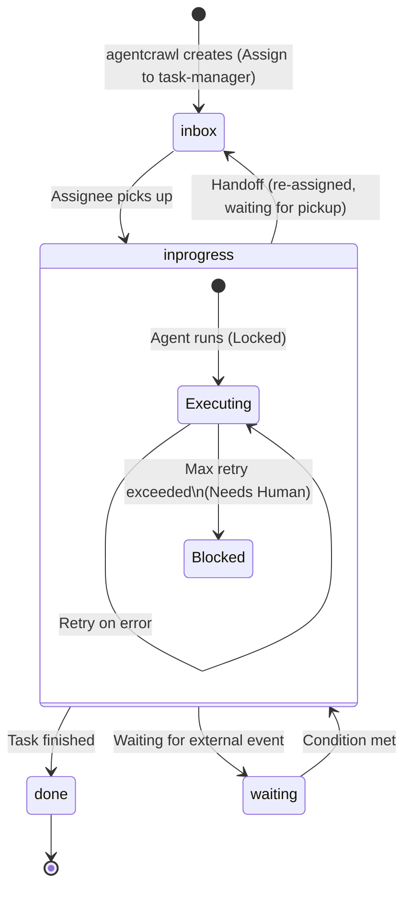

# Architecture

## Overview

AI Agent Workflow System は、AIエージェントによる自律的なワークフロー実行基盤である。
File System を唯一のSource of Truthとし、Database・Queue・API を一切使用しない。

設計思想は以下の1文に集約される。

> **Workflow lives in the File System. Agents only think.**

---

## System Data Flow

```
 [External Event]
        |
  (1) Create Task (Assign: task-manager*)
        v
  +------------+
  | agentcrawl |
  +------------+
        |
        v
  +------------------+
  | $WORKSPACE_ROOT/ |
  |      tasks/      |  <--- (2) inotify watch
  +------------------+         |
        |                      |
        |  (3) spawn subprocess|
        v                      |
  +----------------------------+
  |        agentrun daemon     |
  +----------------------------+
        |         |
        |         +-- [Subprocess] task-manager
        |                (Handoff: system-operator*)
        |
        +-- [Subprocess] system-operator
                 (Execute Task)
        |
        v
    artifacts/
```

### 処理ステップ

1. **Event 読込**: `agentcrawl` が `events/` 配下のファイルを検出
2. **Task 生成**: Taskディレクトリ作成、metadata.yaml 生成、Event ファイル移動
3. **Task 検知**: `agentrun` が inotify またはディレクトリ走査で inbox タスクを検出
4. **Lock 取得**: `mkdir .lock` によるアトミックロック
5. **Agent 起動**: OpenCode をサブプロセスとして起動 (timeout 付き)
6. **成果物確認**: artifacts/ の存在確認、サイズ検証
7. **Handoff 確認**: handoff.yaml があれば次担当者へ委譲
8. **完了処理**: status: done → archive/ へ移動

---

## Component Responsibilities

### agentcrawl

| 項目 | 説明 |
|------|------|
| 役割 | イベントソースの監視およびTask生成 |
| 入力 | External Event (Phase 1: ファイルシステム上のファイル配置) |
| 出力 | `$WORKSPACE_ROOT/tasks/<task-id>/` |
| 初期アサイン | 生成したTaskはすべて `task-manager*` にアサイン |
| モード | oneshot (一括処理) / daemon (fsnotify 常時監視) |

### agentrun

| 項目 | 説明 |
|------|------|
| 役割 | Workflow の実行・管理 (Orchestrator) |
| 監視対象 | `tasks/` ディレクトリ全体 |
| リソース管理 | 同時実行Agent数の上限制御 |
| Lock管理 | 他マシンとの競合保護 |
| エラー処理 | Retry、humanへのhandoff |
| モード | oneshot / daemon |

### Agent

| 項目 | 説明 |
|------|------|
| 可做的事項 | task.md読取、event読取、artifacts生成、handoff.yaml生成 |
| 禁止事項 | metadata更新、history更新、Lock管理、Task管理 |

### Human (Supervisor)

| 項目 | 説明 |
|------|------|
| 役割 | 判断、承認、例外対応 |
| 手動再開 | metadata.yaml の `current_assignee` をAgentに戻し `retry_count` を 0 にリセット |

---

## Task Status Model



| Status | 説明 |
|--------|------|
| `inbox` | 未着手 (新規作成、またはhandoff後着手待ち) |
| `inprogress` | 着手済み (Agent実行中、またはエラーでブロック中) |
| `waiting` | 外部要因や他Taskの完了待ち |
| `done` | 処理完了 (Runtime が `archive/` へ移動) |

**エラー (failed)** は独立したステータスではなく、`inprogress` 状態の中での「ブロック状態」として扱う。

---

## Lock Mechanism

### 方式

`mkdir .lock` — POSIXシステム上でアトミックな操作を利用。

### Lock 内容

`.lock/owner.yaml`:

```yaml
daemon_pid: 12345     # agentrunデーモンのPID
worker_pid: 12346     # 起動したAgentサブプロセスのPID
hostname: worker-node-01
acquired_at: 2026-07-18T22:00:00Z
```

### Stale Lock 判定

以下のいずれかに該当する場合、Stale Lock とみなす。

- 記録されたPIDが存在しない (プロセスが死了ている)
- 規定のTTL (デフォルト: 40分) を超過している
- `.lock` ディレクトリ作成後、owner.yaml が作成されなかった / パースできない

### Lock TTL

```
Lock TTL = Agent Timeout × (最大Retry回数 + 1)
         = 10分 × 4 = 40分
```

正常なリトライ処理中にLockがStaleと誤判定されることを防ぐ。

---

## Handoff Mechanism

AgentはTaskを移動しない。次の担当者に委譲したい場合は `handoff.yaml` のみ生成する。

### handoff.yaml 形式

```yaml
next_assignee: code-developer*
reason: ソースコードの実装が必要であると判断したため
```

### next_assignee のパターン

| パターン | 例 | 意味 |
|----------|-----|------|
| `クラス名*` | `code-developer*` | 当該クラスの空きインスタンスすべて |
| `インスタンス名` | `system-operator1` | 特定のインスタンスを指名 |
| `human` | `human` | 人間に判断を仰ぐ |

### Tolerant Parsing

LLMがMarkdownコードブロックで囲んで出力しても、正規表現でYAMLブロックを抽出する。

```go
// ```yaml ... ``` で囲まれた場合でもパース可能
yamlBlockPattern = regexp.MustCompile("(?s)```yaml\\s*\n(.*?)\n\\s*```")
```

### 処理フロー

```
(1) handoff.yaml 読み取り
(2) History への記録 (history/XXXX-handoff.md)
(3) metadata.yaml 更新 (status: inbox, current_assignee: next_assignee)
```

途中でクラッシュした場合でも、不整合は発生しない。

---

## Recovery

### Crashed Task

`status: inprogress` かつ有効なLockが存在しないTaskを検知した場合、クラッシュとみなし `status: inbox` に戻す。

### Orphan Process

Stale Lock に記録されている `worker_pid` のプロセスがOS上でまだ稼働している場合は、`SIGKILL` で強制終了させる。

### Human タスク

`current_assignee` が `human` で `inprogress` の場合は、人間が作業中とみなしリカバリの対象外とする。

---

## Retry

| 項目 | 値 |
|------|-----|
| 最大Retry回数 | 3 (デフォルト) |
| Timeout | 10分 (デフォルト) |
| 超過時処理 | `current_assignee: human` に変更、Lock解放 |

### 人間介入後の再開手順

```bash
# metadata.yaml を手動で編集
current_assignee: system-operator  # human → 対象Agent
retry_count: 0                      # リセット
```

---

## Logging

Runtime は以下を記録する。

- アサインされたAgentのクラスとプロセスPID
- Task ID
- 実行開始 / 実行終了
- Exit Code
- Retry回数
- Error

ログ形式: `log/slog` (JSON または Text)
