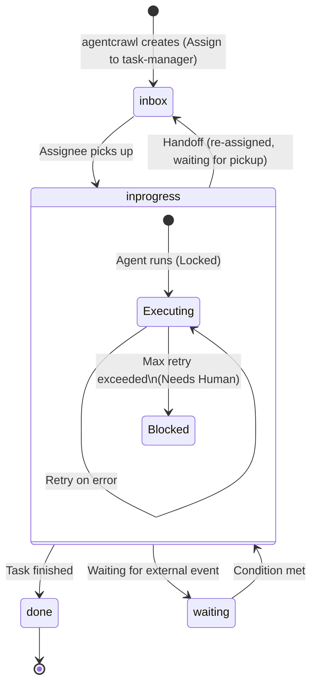

# AI Agent Workflow System
## Implementation Plan

Version: 2.5

---

# 1. Project Overview

本プロジェクトは **myaitoolbox** に、AIエージェントによるワークフロー実行基盤を追加する。

本システムは以下の思想に基づいて設計する。

- Agentは単なるCLIである
- Workflowはファイルシステムで表現する
- Taskはディレクトリとして管理する
- Databaseを使用しない
- Queueを使用しない
- APIを前提としない
- MarkdownとYAMLを唯一の管理フォーマットとする
- Gitによる履歴管理を前提とする

LLMは「考えること」に専念し、Workflow管理はRuntimeが担当する。

---

# 2. Goals

本プロジェクトの目的は以下である。

- AI Agentによる自律的なWorkflowを実現する
- Agent間を疎結合にする
- HumanをWorkflowへ自然に参加させる
- OpenCode以外のLLMにも容易に対応できる設計とする
- File SystemだけでWorkflowが成立するようにする

---

# 3. Scope

今回実装するのは以下の2ツールである。

```
myaitoolbox/

├── mcpctl/
├── mcpserve/
└── agentworkflow/
    ├── agentcrawl/ <- 新規開発
    └── agentrun/ <- 新規開発
```

## agentcrawl

イベントを検知、または指定されたイベントを読み込み、Taskを生成する。

起動例:
```bash
# デーモンモード（ファイルドロップの常時監視）
agentcrawl --watch --dir ./events/incoming

# ワンショットモード（現在のディレクトリ内のイベントを処理して即座に終了）
agentcrawl --dir ./events/incoming
```

役割

- イベントソースの監視および読み込み
- Taskディレクトリの生成
- **Taskの初期アサイン (生成したTaskはすべて `task-manager*` にアサインする)**

入力

```
External Event (Phase 1: ファイルシステム上の特定ディレクトリへのファイル配置)
```

出力

```
$WORKSPACE_ROOT/tasks/<task-id>/
```

**Eventファイルのライフサイクル:**
二重処理（Duplicate processing）を防ぐため、`agentcrawl` はTaskディレクトリ（`$WORKSPACE_ROOT/tasks/<task-id>/event/`）を生成後、読み込んだ元のEventファイルを同ディレクトリ内へ移動（mv）する。

Task生成のみ担当する。
Workflowの実行は行わない。

---

## agentrun

Taskディレクトリ全体を監視、または一括処理し、Agentをサブプロセスとして起動・管理する中央ランタイム（Orchestrator）。
デーモンモードでは inotify（またはfsevents）等のイベント監視を利用し、1つのプロセスがすべてのTaskのライフサイクルを管理する。

起動例:
```bash
# デーモンモード（タスクの常時監視・イベント駆動）
agentrun --watch --dir $WORKSPACE_ROOT

# ワンショットモード（現在 inbox にあるタスクをすべて処理して終了）
agentrun --dir $WORKSPACE_ROOT
```

役割

- Task監視・処理（`tasks/` ディレクトリ全体の監視、または一括処理）
- リソースと並行実行数の管理（例: 同時実行Agent数の上限制御）
- Lock管理（他マシンとの競合保護のため）
- Agentのサブプロセス起動とタイムアウト制御
- 成果物の最低限のバリデーション
- metadata更新
- history更新
- handoff処理
- 異常終了時・クラッシュ時のリカバリ処理

---

# 4. Overall Architecture

`agentrun` デーモンが中央で監視を行い、対象となるAgentをサブプロセスとして起動する。

```
 [External Event]
        |
  (1) Create Task (Assign: task-manager*)
        v
  +------------+
  | agentcrawl |
  +------------+
        |
        v
  +------------------+
  | $WORKSPACE_ROOT/ |
  |      tasks/      |  <--- (2) inotify watch
  +------------------+         |
        |                      |
        |  (3) spawn subprocess|
        v                      |
  +----------------------------+
  |        agentrun daemon     |
  +----------------------------+
        |         |
        |         +-- [Subprocess] task-manager
        |                (Handoff: system-operator*)
        |
        +-- [Subprocess] system-operator
                 (Execute Task)
        |
        v
    artifacts/
```

---

# 5. Workspace Layout

環境変数 `WORKSPACE_ROOT` または設定ファイルで定義されたパスを起点とする。

```
$WORKSPACE_ROOT/

├── agents/
│   ├── task-manager/   <- Taskのトリアージ・ルーティング担当
│   │
│   ├── system-operator/
│   │   ├── AGENTS.md
│   │   ├── skills/
│   │   └── knowledge/
│   │
│   ├── code-developer/
│   ├── code-review-manager/ <- 複数reviewerへの依頼、結果集約・調停、差し戻し判定を行う
│   ├── code-reviewer/
│   └── supervisor/
│
├── tasks/          <- アクティブなTask
│
├── archive/        <- 完了(done)したTaskの退避先
│
├── events/
│
└── runtime/
```

### agents/ ディレクトリの管理規約
- `AGENTS.md`: Agentの定義ファイル。最低限「名前」「役割」「対応可能なTaskの種類」を記述する。
- `skills/`: Agentが実行可能なスクリプトや手順書（Markdown/シェルスクリプト等）。
- `knowledge/`: Agentが参照すべきドメイン知識やコーディング規約（Markdown等）。

---

# 6. Task Structure

```
tasks/

└── <task-id>/

    metadata.yaml

    task.md

    event/

    artifacts/

    history/
```

Task Directoryは原則として削除しない。
Taskは永続オブジェクトとするが、完了後(done)はinotifyの監視リソース解放のため `archive/` へ移動される。

### Task ID生成ルール
一意性および時系列でのソート可能性を確保するため、以下の形式を採用する。
形式: `YYYYMMDD-HHMMSS-<source>-<short-hash>`
(例: `20260718-221200-file-a3f2b1`)
`<source>` はイベントソースを表す短い識別子（例: `file`, `github`, `jira`）。Phase 1 では `file` を使用する。
※将来的にULIDやUUID v7への移行も検討可能とする。

---

# 7. metadata.yaml と Task Status

Runtime専用。Agentは更新禁止。

```yaml
id:

title:

status:

current_assignee: # 例: "system-operator*" (任意のsystem-operator) または "system-operator1" (特定のインスタンス)
                          # 接尾辞 `*` は「当該クラスの空きインスタンスすべて」を意味し、
                          # Runtimeは該当クラスの agents/ 配下から空きのインスタンスを1つ選択してアサインする。

priority:

retry_count:

created_at:

updated_at:

source:
```

### Task Status と遷移ルール (GTD/Kanbanモデル)

`status` はタスクの大きな進捗状態（カンバンボードのカラム）を表し、取りうる値は以下の4つのみとする。

- `inbox`: 未着手（新規作成、または別担当者へhandoffされ、着手を待っている状態）
- `inprogress`: 着手済み（Agentが実行中、またはエラーでブロックされ人間の介入を待っている状態を含む）
- `waiting`: 外部要因や他Taskの完了待ち
- `done`: 処理完了（この状態になった直後、Runtimeによって `archive/` へ移動される）

実行エラー（failed）は独立したステータスではなく、`inprogress` 状態の中での「ブロック状態」として扱う。



---

# 8. task.md

LLMへの指示。

Markdownで記述する。

例

```
event.jsonを解析してください。

結果を

artifacts/report.md

へ保存してください。

必要であれば

handoff.yaml

を書いてください。（純粋なYAML形式のみ出力し、Markdown装飾を含めないこと）
```

---

# 9. Event Directory

イベント原本。

```
event/

alert.json

proposal.md

github_issue.json
```

変更禁止。

---

# 10. Artifacts

成果物。

```
artifacts/

report.md

implementation_plan.md

review.md

patch.diff
```

制限なし。ただし、Phase 1の実装において、agentrunは成果物の最低限のバリデーション（出力ファイルの存在確認、サイズ > 0の確認など）を行う。

---

# 11. History

Runtimeのみ更新。

```
history/

0001-created.md

0002-started.md

0003-finished.md

0004-handoff.md
```

Workflow監査ログとして利用する。

---

# 12. Handoff

AgentはTaskを移動しない。
自力で処理を完了できない場合、または次の担当者（他のAgentや人間）に処理を委譲したい場合は

```
handoff.yaml
```

のみ生成する。LLMへのプロンプト指示としては「Markdownのコードブロックを含まない純粋なYAMLファイルとして出力すること」を徹底させる。

**agentrun側のパース要件（Tolerant Parsing）:**
ただし、LLMが指示を無視して ` ```yaml ... ``` ` のようにMarkdownブロックで囲んで出力してしまうケースに備え、`agentrun` 側のYAMLパーサーは寛容（Tolerant）に実装すること。**具体的には、出力テキスト全体から正規表現（例: `` ```yaml\n([\s\S]*?)\n``` ``）を用いてYAMLブロックのみを抽出する前処理を必須とし**、不要なエラーやリトライをシステム側で吸収する工夫を入れる。

**典型的なユースケース（task-managerによるトリアージ）:**
`agentcrawl` によって生成された新規Taskは、すべて `task-manager*` に初期アサインされる。`task-manager` エージェントはイベントの内容を解析し、適切なAgentへ処理を委譲する `handoff.yaml` を生成して終了する。

例1: 役割（クラス）を指定して、手の空いている誰かに委譲する場合
```yaml
next_assignee: code-developer*
reason: ソースコードの実装が必要であると判断したため
```

例2: 特定のインスタンス（以前のコンテキストを持つAgentなど）を指名する場合
```yaml
next_assignee: system-operator1
reason: 以前の対応の続きであるため
```

例3: 人間に判断を仰ぐ場合
```yaml
next_assignee: human
reason: 承認が必要なため
```

**整合性保証:**
Runtimeは以下の順序で処理を行い、途中でクラッシュした場合の不整合を防ぐ。
1. `handoff.yaml` の読み取り
2. Historyへの記録 (`history/XXXX-handoff.md` の作成)
3. `metadata.yaml` の更新 (`status: inbox`, `current_assignee`の変更)

---

# 13. Code Review Workflow (State Machine Pattern)

複雑なワークフローも、追加のメカニズム（Subtask等）なしで実現できる。
`code-review-manager` を中心としたレビュープロセスは、タスクディレクトリ内（`artifacts/`）の状態を読み取り、順次担当者を切り替える（Sequential Handoff）ことで実現する。

**ブラインドレビューとコンフリクト調停のフロー例:**
1. **タスク受領と初回判断**: `code-review-manager` がレビュータスクを受け取る。
2. **レビュー依頼 (1人目)**: `code-review-manager` は `handoff.yaml` で `next_assignee: code-reviewer*` に委譲する。
3. **レビュー実行と返却**: `code-reviewer` が処理を行い、`artifacts/current_review.md` を作成してマネージャーに返す。
4. **レビューの隠蔽（ブラインド化）と次への依頼**: `code-review-manager` がタスクを受け取る。他のレビュアーに結果を見せないため、`artifacts/current_review.md` を `artifacts/.manager_private/review_1.md` に移動（隠蔽）する。その後、2人目の `code-reviewer*` に委譲する。
5. **レビュー実行と返却 (2人目)**: 2人目の `code-reviewer` は前のレビューを見ることなく独立して処理し、`artifacts/current_review.md` を作成してマネージャーに返す。
6. **結果集約・調停（Mediation）**: `code-review-manager` がタスクを受け取り、`.manager_private/` に集められたすべてのレビューを読み比べる。もし「AはXを推奨、Bは非Xを推奨」といった**コンフリクト（意見の衝突）**があれば、マネージャーが方針を決定・調停し、開発者が迷わないように一つの整理された `artifacts/final_review_report.md` を作成する。
7. **差し戻し or 完了**:
   - 修正が必要な場合: 調停済みの `final_review_report.md` を添えて、`next_assignee: code-developer*` へ差し戻す。
   - 品質が十分な場合: タスクを `done` とするか、次の工程へ Handoff する。

**状態管理（State Management）について:**
`code-review-manager` のように「複数人のレビュー完了を待つ」といったステートフルな振る舞いが求められるAgentは、自身が現在どの状態にあるかを記憶しておく必要があります。このような場合、Agentは `artifacts/.manager_state.json` のような独自のステートファイルを `artifacts/` 配下に生成・更新して状態を管理します。このステートファイルは **Agent専用** であり、Runtime が参照・解釈することはありません。Runtime が参照するのは `metadata.yaml` と `handoff.yaml` のみです。

---

# 14. Runtime Responsibilities

Runtime(agentrun)の責務。

```
Task検知 (daemonモード: inotifyで更新フック / oneshotモード: ディレクトリ走査で status: inbox を検知)

↓

対象Agentの特定 (current_assignee をパース)

↓

Lock取得 (mkdir)

↓

metadata更新 (status: inprogress)

↓

Agentサブプロセス起動 (対象のAgentを非同期でkick、Timeout設定を伴う)

↓

成果物バリデーション

↓

handoff確認

↓

history更新

↓

status更新 (done / inbox / waiting / inprogressのまま委譲)

↓

Unlock

↓

(doneの場合のみ) Taskディレクトリを archive/ へ移動
```

**異常終了時のリカバリ処理とオーファンプロセス対策:**
agentrunデーモンの起動時および定期チェック時に、「`status: inprogress` かつ `current_assignee` がAgentであるにもかかわらず、有効なLockが存在しないTask（あるいは紐づくサブプロセスが不意に消滅しているTask）」を検知した場合、クラッシュしたとみなし、`status: inbox` に戻してリカバリを行う。
その際、Stale Lock（異常残存したLockファイル）に記録されている `worker_pid` を読み取り、該当プロセスがOS上でまだ稼働している場合は、オーファン（孤児）プロセスとして勝手に処理を進めることを防ぐため、プロセスグループごと `SIGKILL` 等で強制終了させるクリーンアップ処理を行う。
※ `current_assignee` が人間（human）で `inprogress` の場合は、人間が作業中（またはエラー対応中）とみなすためリカバリの対象外とする。

---

# 15. Agent Responsibilities

Agentは禁止事項。

- metadata更新
- history更新
- Lock管理
- Task管理

Agentが実施すること。

- task.mdを読む
- eventを読む
- knowledgeを読む
- skillsを読む
- artifacts生成 (必要に応じて自身の中間状態を記録するステートファイルを含む)
- handoff生成 (handoff.yaml)

---

# 16. Agent Execution

初期実装ではOpenCodeを利用する。
Runtimeは `current_assignee` の値（例: `task-manager*` なら `task-manager`）から対象ディレクトリを決定し、サブプロセスとして以下を実行する。

```bash
opencode run \
    --dir agents/<agent-class> \
    --file tasks/<task-id>/task.md \
    --thinking \
    --format json
```

OpenCode依存を抽象化し、将来的に Claude Code, Codex CLI, Gemini CLI へ置き換え可能にする。
Phase 1 では OpenCode のみをサポートするが、agentrun 内の LLM呼び出しは薄いアダプタ層（LLM adapter）を経由する形とし、将来的な LLM 切り替え時に変更がアダプタ層のみに局所化されるようにする。

---

# 17. Lock

中央監視アーキテクチャではローカルPC内での競合は発生しにくいが、共有ネットワークドライブ経由でのマルチノード稼働などを見据え、アトミックな排他制御を実装する。

**Lock仕様:**
- **方式:** `mkdir .lock` (POSIXシステム上でアトミックな操作を利用)
- **Lock内容:** `.lock/owner.yaml` を作成し、以下を記録する。
  ```yaml
  daemon_pid: 12345     # agentrunデーモンのPID
  worker_pid: 12346     # 起動したAgentサブプロセスのPID
  hostname: worker-node-01
  acquired_at: 2026-07-18T22:00:00Z
  ```
- **Stale Lock判定:** 記録されたPIDが存在しない場合、または規定のTTL（例: 2時間）を超過している場合は、Stale Lockとみなし強制解除可能とする。また、`mkdir .lock` 実行直後にプロセスがクラッシュし `owner.yaml` が作成されなかったケースを考慮し、「`.lock` ディレクトリ作成から数秒経過しても `owner.yaml` が存在しない、あるいはパースできない場合」も異常終了とみなしロックを強制解除する。
- **Lock TTLとAgent Timeoutの関係:** Lock TTLは `Agent Timeout × (最大Retry回数 + 1)` 以上に設定すること。これにより、正常なリトライ処理中にLockがStaleと誤判定されることを防ぐ。

---

# 18. Retry と Timeout

失敗時（Agentのエラー終了など）は `retry_count` を更新し、ステータスは `inprogress` のままリトライを試みる。
最大Retry超過時は、ステータスを `inprogress` に据え置いたまま `current_assignee` を `human` (または管理者) に変更し、Lockを解放する。これにより「着手済みだがエラーでブロックされている」状態を表現し、人間の介入（ログ確認、バグ修正、手動リカバリなど）を待つ。

**人間介入後の再開手順:**
エラー要因を取り除いた後、人間が `metadata.yaml` の `current_assignee` を再度対象のAgentに戻し、`retry_count` を `0` にリセットすることで、Runtimeが再びTaskを検知し処理が再開される。

**Timeout:**
LLM呼び出しのハングアップを防ぐため、Phase 1から最低限のタイムアウト（例: 10分）を設ける。タイムアウト発生時は1回のエラー（Failed）として扱い、リトライロジックに乗せる。

---

# 19. Logging

Runtimeは以下を記録する。

- アサインされたAgentのクラスとプロセスPID
- Task ID
- 実行開始
- 実行終了
- Exit Code
- Retry回数
- Error

---

# 20. Future Extensions
... (省略せずに記載)
- Routing Rule
- Priority Queue
- Scheduler
- Dashboard
- Web UI
- Metrics
- Notification
- Approval Workflow
- Parallel Execution
- Multi-Agent Collaboration
- MCP Integration
- WGS Integration
- Knowledge Repository
- Skill Repository
- Filesystem Scalability (アーカイブされたタスクの `archive/YYYY/MM/DD/` 形式による階層化等のパフォーマンス対策)

---

# 21. Development Phases

## Phase 1

### agentcrawl
- `--watch` オプションの有無による、daemonモード（常時監視）とoneshotモード（一括処理）の切り替え実装
- Event読込
- Task生成 (初期アサイン: `task-manager*`)

### agentrun
- `--watch` オプションの有無による、daemonモードとoneshotモードの切り替え実装
- Task監視・処理 (inotifyを活用したイベント駆動、または一括バッチ処理)
- Lock (mkdirによるアトミックロックとstale判定)
- 異常終了時のリカバリ
- OpenCode起動 (タイムアウト制御付き)
- Retry (失敗時のリトライ、最大 Retry 超過時の人間への handoff)
- 成果物の最低限のバリデーション
- status更新 (inbox/inprogress/done)
- history更新
- handoff (task-manager等からの委譲に対応するため、最低限のルーティング機能をPhase 1に含める)

ここまでで最低限動作し、堅牢な実行基盤を確立する。

---

## Phase 2
- waiting / 条件分岐
- イベントソースの抽象化 (GitHub/Jira等への対応)

---

## Phase 3
- 複数Agentの連携高度化
- Scheduler
- Dashboard
- Metrics

---

## Phase 4
- Plugin化
- 複数LLM対応
- Remote Workspace対応

---

# 22. Acceptance Criteria

最低限以下が動作すること。

- EventからTask生成 (初期アサイン先制御を含む)
- agentrunによるTask検知 (ワイルドカード/名前一致)
- Agent起動とタイムアウト制御
- Artifacts生成とバリデーション
- metadata更新
- history更新
- アトミックなLockとリカバリ
- Retry
- handoff (task-manager等からの委譲)

Databaseを使用しないこと。
Workflow状態がすべてFile System上に存在すること。
OpenCodeを将来置き換えられる構造になっていること。

---

# 23. Design Philosophy

このプロジェクトは「LLMを賢くする」ことを目的としない。
目的は、LLMが安全かつ協調的に動作するための**シンプルで堅牢なワークフロー基盤**を提供することである。

設計思想は以下の一文に集約される。

> **Workflow lives in the File System. Agents only think.**

また、各コンポーネントの責務は明確に分離する。

| Component | Responsibility |
|-----------|----------------|
| **agentcrawl** | 外部イベントをTaskへ変換し `task-manager` へアサインする |
| **agentrun** | Workflowを実行・管理する |
| **Agent** | Taskを理解し成果物を生成・委譲する |
| **Human (Supervisor)** | 判断・承認・例外対応を行う |
| **File System** | Workflowの唯一のSource of Truth |
