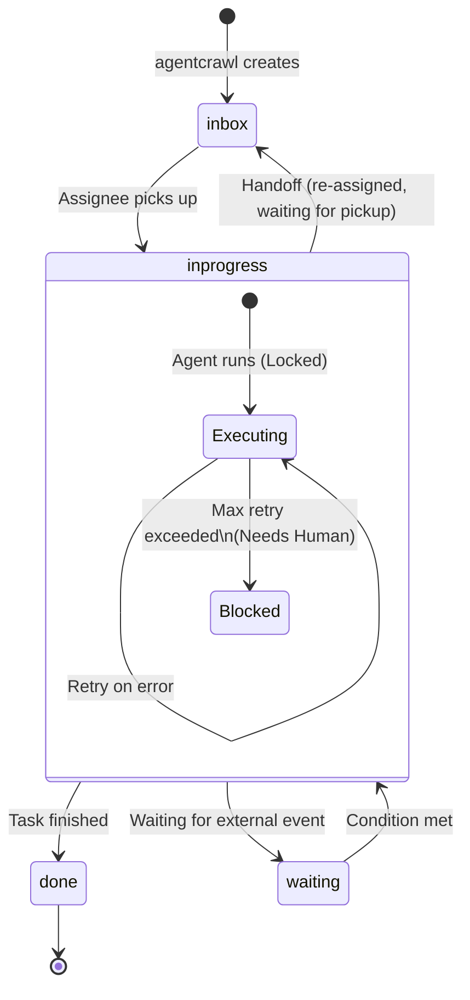

# AI Agent Workflow System
## Implementation Plan

Version: 2.3

---

# 1. Project Overview

本プロジェクトは **myaitoolbox** に、AIエージェントによるワークフロー実行基盤を追加する。

本システムは以下の思想に基づいて設計する。

- Agentは単なるCLIである
- Workflowはファイルシステムで表現する
- Taskはディレクトリとして管理する
- Databaseを使用しない
- Queueを使用しない
- APIを前提としない
- MarkdownとYAMLを唯一の管理フォーマットとする
- Gitによる履歴管理を前提とする

LLMは「考えること」に専念し、Workflow管理はRuntimeが担当する。

---

# 2. Goals

本プロジェクトの目的は以下である。

- AI Agentによる自律的なWorkflowを実現する
- Agent間を疎結合にする
- HumanをWorkflowへ自然に参加させる
- OpenCode以外のLLMにも容易に対応できる設計とする
- File SystemだけでWorkflowが成立するようにする

---

# 3. Scope

今回実装するのは以下の2ツールである。

```
myaitoolbox/

├── mcpctl/
├── mcpserve/
├── agentcrawl/ <- 新規開発
└── agentrun/ <- 新規開発
```

## agentcrawl

イベントを監視し、Taskを生成する。

役割

- イベントソースの監視 (Phase 1では指定ディレクトリへのファイルドロップ監視のみとする)
- Taskディレクトリの生成

入力

```
External Event (Phase 1: ファイルシステム上の特定ディレクトリへのファイル配置)
```

出力

```
$WORKSPACE_ROOT/tasks/<task-id>/
```

Task生成のみ担当する。
Workflowの実行は行わない。

---

## agentrun

Taskを監視し、担当Agentへ処理を依頼するRuntime。
複数インスタンスでの稼働（早い者勝ちによるTask分散）を前提とする。

役割

- Task監視
- Lock管理
- Agent起動とタイムアウト制御
- 成果物の最低限のバリデーション
- metadata更新
- history更新
- handoff処理
- 異常終了時のリカバリ処理

---

# 4. Overall Architecture

```
                +-------------------+
                |   agentcrawl      |
                +---------+---------+
                          |
                          |
                    Create Task
                          |
                          v
                +-------------------+
                | $WORKSPACE_ROOT/  |
                |      tasks/       |
                +---------+---------+
                          |
                          |
                    Watch Task
                          |
                          v
                +-------------------+
                |     agentrun      |
                +---------+---------+
                          |
                          |
                  Execute Agent
                          |
                          v
                +-------------------+
                |      Agent        |
                +---------+---------+
                          |
                  Generate Artifacts
                          |
                          v
                    artifacts/
```

---

# 5. Workspace Layout

環境変数 `WORKSPACE_ROOT` または設定ファイルで定義されたパスを起点とする。

```
$WORKSPACE_ROOT/

├── agents/
│   ├── operator/
│   │   ├── AGENTS.md
│   │   ├── skills/
│   │   └── knowledge/
│   │
│   ├── developer/
│   ├── reviewer/
│   └── supervisor/
│
├── tasks/
│
├── events/
│
└── runtime/
```

### agents/ ディレクトリの管理規約
- `AGENTS.md`: Agentの定義ファイル。最低限「名前」「役割」「対応可能なTaskの種類」を記述する。
- `skills/`: Agentが実行可能なスクリプトや手順書（Markdown/シェルスクリプト等）。
- `knowledge/`: Agentが参照すべきドメイン知識やコーディング規約（Markdown等）。

---

# 6. Task Structure

```
tasks/

└── <task-id>/

    metadata.yaml

    task.md

    event/

    artifacts/

    history/
```

Task Directoryは削除・移動しない。
Taskは永続オブジェクトとする。

### Task ID生成ルール
一意性および時系列でのソート可能性を確保するため、以下の形式を採用する。
形式: `YYYYMMDD-HHMMSS-<source>-<short-hash>`
(例: `20260718-221200-file-a3f2b1`)
※将来的にULIDやUUID v7への移行も検討可能とする。

---

# 7. metadata.yaml と Task Status

Runtime専用。Agentは更新禁止。

```yaml
id:

title:

status:

current_assignee:

priority:

retry_count:

created_at:

updated_at:

source:
```

### Task Status と遷移ルール (GTD/Kanbanモデル)

`status` はタスクの大きな進捗状態（カンバンボードのカラム）を表し、取りうる値は以下の4つのみとする。

- `inbox`: 未着手（新規作成、または別担当者へhandoffされ、着手を待っている状態）
- `inprogress`: 着手済み（Agentが実行中、またはエラーでブロックされ人間の介入を待っている状態を含む）
- `waiting`: 外部要因や他Taskの完了待ち
- `done`: 処理完了

実行エラー（failed）は独立したステータスではなく、`inprogress` 状態の中での「ブロック状態」として扱う。



---

# 8. task.md

LLMへの指示。

Markdownで記述する。

例

```
event.jsonを解析してください。

結果を

artifacts/report.md

へ保存してください。

必要であれば

handoff.md

を書いてください。
```

---

# 9. Event Directory

イベント原本。

```
event/

alert.json

proposal.md

github_issue.json
```

変更禁止。

---

# 10. Artifacts

成果物。

```
artifacts/

report.md

implementation_plan.md

review.md

patch.diff
```

制限なし。ただし、Phase 1の実装において、agentrunは成果物の最低限のバリデーション（出力ファイルの存在確認、サイズ > 0の確認など）を行う。

---

# 11. History

Runtimeのみ更新。

```
history/

0001-created.md

0002-started.md

0003-finished.md

0004-handoff.md
```

Workflow監査ログとして利用する。

---

# 12. Handoff

AgentはTaskを移動しない。
自力で処理を完了できない場合、または次の担当者（他のAgentや人間）に処理を委譲したい場合は

```
handoff.md
```

のみ生成する。

例

```yaml
next_assignee: developer1 # 人間に判断を仰ぐ場合は human や supervisor などを指定する

reason: 実装が必要
```

**整合性保証:**
Runtimeは以下の順序で処理を行い、途中でクラッシュした場合の不整合を防ぐ。
1. `handoff.md` の読み取り
2. Historyへの記録 (`history/XXXX-handoff.md` の作成)
3. `metadata.yaml` の更新 (`status: inbox`, `current_assignee`の変更)

---

# 13. Runtime Responsibilities

Runtime(agentrun)の責務。

```
Task検知 (status: inbox)

↓

Lock取得 (mkdir)

↓

metadata更新 (status: inprogress)

↓

Agent起動 (Timeout設定を伴う)

↓

成果物バリデーション

↓

handoff確認

↓

history更新

↓

status更新 (done / inbox / waiting / inprogressのまま委譲)

↓

Unlock
```

**異常終了時のリカバリ処理:**
agentrunの起動時および定期ポーリング時に、「`status: inprogress` かつ `current_assignee` がAgentであるにもかかわらず、有効なLockが存在しないTask」を検知した場合、クラッシュしたとみなし、`status: inbox` に戻してリカバリを行う。
※ `current_assignee` が人間（human）で `inprogress` の場合は、人間が作業中（またはエラー対応中）とみなすためリカバリの対象外とする。

---

# 14. Agent Responsibilities

Agentは禁止事項。

- metadata更新
- history更新
- Lock管理
- Task管理

Agentが実施すること。

- task.mdを読む
- eventを読む
- knowledgeを読む
- skillsを読む
- artifacts生成
- handoff生成

---

# 15. Agent Execution

初期実装ではOpenCodeを利用する。

Runtimeは以下を実行する。

```bash
opencode run \
    --dir agents/operator \
    --file tasks/<task-id>/task.md \
    --thinking \
    --format json
```

OpenCode依存を抽象化し、

将来的に

- Claude Code
- Codex CLI
- Gemini CLI

へ置き換え可能にする。

---

# 16. Lock

同一Taskを複数Runtimeが処理しないよう、アトミックな排他制御を実装する。

**Lock仕様:**
- **方式:** `mkdir .lock` (POSIXシステム上でアトミックな操作を利用)
- **Lock内容:** `.lock/owner.yaml` を作成し、以下を記録する。
  ```yaml
  pid: 12345
  hostname: worker-node-01
  acquired_at: 2026-07-18T22:00:00Z
  ```
- **Stale Lock判定:** 記録されたPIDが存在しない場合、または規定のTTL（例: 2時間）を超過している場合は、Stale Lockとみなし強制解除可能とする。

---

# 17. Retry と Timeout

失敗時（Agentのエラー終了など）は

```
retry_count
```

を更新し、ステータスは `inprogress` のままリトライを試みる。
最大Retry超過時は、ステータスを `inprogress` に据え置いたまま `current_assignee` を `human` (または管理者) に変更し、Lockを解放する。これにより「着手済みだがエラーでブロックされている」状態を表現し、人間の介入（ログ確認、バグ修正、手動リカバリなど）を待つ。

**Timeout:**
LLM呼び出しのハングアップを防ぐため、Phase 1から最低限のタイムアウト（例: 10分）を設ける。タイムアウト発生時は1回のエラー（Failed）として扱い、リトライロジックに乗せる。

---

# 18. Logging

Runtimeは以下を記録する。

- Agent名
- Task ID
- 実行開始
- 実行終了
- Exit Code
- Retry回数
- Error

---

# 19. Future Extensions

以下を考慮した設計とする。

- Routing Rule
- Priority Queue
- Scheduler
- Dashboard
- Web UI
- Metrics
- Notification
- Approval Workflow
- Parallel Execution
- Multi-Agent Collaboration
- MCP Integration
- WGS Integration
- Knowledge Repository
- Skill Repository

---

# 20. Development Phases

## Phase 1

### agentcrawl

- ファイル配置監視 (指定ディレクトリ)
- Event読込
- Task生成 (規約に沿ったTask ID生成)

### agentrun

- Task監視
- Lock (mkdirによるアトミックロックとstale判定)
- 異常終了時のリカバリ
- OpenCode起動 (タイムアウト制御付き)
- 成果物の最低限のバリデーション
- status更新 (inbox/inprogress/done)
- history更新

ここまでで最低限動作し、堅牢な実行基盤を確立する。

---

## Phase 2

- handoff
- retry
- waiting / 条件分岐
- イベントソースの抽象化 (GitHub/Jira等への対応)
- routing

---

## Phase 3

- 複数Agent
- Scheduler
- Dashboard
- Metrics

---

## Phase 4

- Plugin化
- 複数LLM対応
- Remote Workspace対応

---

# 21. Acceptance Criteria

最低限以下が動作すること。

- EventからTask生成
- agentrunによるTask検知
- Agent起動とタイムアウト制御
- Artifacts生成とバリデーション
- metadata更新
- history更新
- アトミックなLockとリカバリ
- Retry
- handoff

Databaseを使用しないこと。

Workflow状態がすべてFile System上に存在すること。

OpenCodeを将来置き換えられる構造になっていること。

---

# 22. Design Philosophy

このプロジェクトは「LLMを賢くする」ことを目的としない。

目的は、LLMが安全かつ協調的に動作するための**シンプルで堅牢なワークフロー基盤**を提供することである。

設計思想は以下の一文に集約される。

> **Workflow lives in the File System. Agents only think.**

また、各コンポーネントの責務は明確に分離する。

| Component | Responsibility |
|-----------|----------------|
| **agentcrawl** | 外部イベントをTaskへ変換する |
| **agentrun** | Workflowを実行・管理する |
| **Agent** | Taskを理解し成果物を生成する |
| **Human (Supervisor)** | 判断・承認・例外対応を行う |
| **File System** | Workflowの唯一のSource of Truth |
